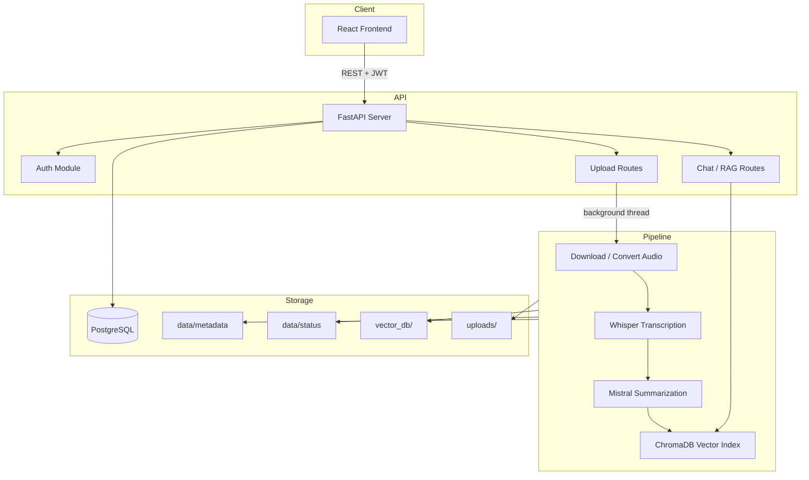

# AI Video Assistant

An intelligent full-stack application that transforms videos and meeting recordings into searchable, conversational knowledge. Upload a YouTube link or a local file, and the system transcribes the content, generates AI-powered summaries and insights, and lets you chat with the material using retrieval-augmented generation (RAG).

---

## Features

- **User authentication** — Register, login, JWT-based sessions, and password reset via email
- **Flexible input** — YouTube URLs or local video/audio file uploads
- **Automatic transcription** — OpenAI Whisper converts speech to text
- **AI summarization** — Meeting titles, summaries, action items, key decisions, and open questions via Mistral AI
- **RAG chat** — Ask natural-language questions grounded in the video transcript
- **Real-time progress** — Live processing status from upload through completion
- **Per-user library** — Each user sees only their own videos and chat history
- **Modern UI** — React frontend with light/dark mode and responsive layout

---

## Tech Stack

| Layer | Technologies |
|-------|----------------|
| **Frontend** | React 19, Vite 7, Tailwind CSS 4, React Router, Axios |
| **Backend** | FastAPI, Uvicorn, SQLAlchemy, Pydantic |
| **Database** | PostgreSQL |
| **Auth** | JWT (python-jose), bcrypt |
| **Transcription** | OpenAI Whisper |
| **LLM** | Mistral AI (LangChain) |
| **Vector store** | ChromaDB, HuggingFace `all-MiniLM-L6-v2` embeddings |
| **Media** | yt-dlp, FFmpeg, pydub |

---

## Architecture



### Processing pipeline

1. **Queued** — Job accepted and stored in the database  
2. **Downloading** — YouTube audio fetched or local file converted (FFmpeg)  
3. **Transcribing** — Whisper generates a full transcript  
4. **Summarizing** — Mistral produces title and summary  
5. **Extracting** — Action items, decisions, and open questions extracted  
6. **Building RAG** — Transcript chunked, embedded, and stored in ChromaDB  
7. **Completed** — Metadata saved; video ready for chat  

---

## Project Structure

```
Ai Video Assistant/
├── app/                    # FastAPI application
│   ├── api/                # Route handlers (auth, upload, chat, videos, …)
│   ├── services/           # Business logic
│   ├── main.py             # App entry point
│   └── database.py         # SQLAlchemy setup
├── core/                   # AI pipeline (transcriber, RAG, vector store)
├── utils/                  # Audio processing (yt-dlp, pydub)
├── frontend/               # React + Vite client
│   └── src/
│       ├── api/            # Axios API client
│       ├── pages/          # Login, Home, VideoDetails, …
│       └── components/     # ChatBot, Progress, ThemeToggle, …
├── pipeline.py             # End-to-end video processing orchestration
├── run.py                  # Local dev server launcher
├── requirements.txt        # Python dependencies
├── Dockerfile              # Container build (optional)
└── .env.example            # Environment variable template
```

---

## Prerequisites

Before running locally, install:

- **Python 3.10+**
- **Node.js 18+** and npm
- **PostgreSQL 14+**
- **FFmpeg** (required for audio extraction and conversion)

### FFmpeg installation

| OS | Command |
|----|---------|
| Windows | `winget install FFmpeg` or download from [ffmpeg.org](https://ffmpeg.org) |
| macOS | `brew install ffmpeg` |
| Ubuntu | `sudo apt install ffmpeg` |

---

## Getting Started

### 1. Clone the repository

```bash
git clone https://github.com/YOUR_USERNAME/ai-video-assistant.git
cd ai-video-assistant
```

### 2. Set up PostgreSQL

Create a database and user:

```sql
CREATE DATABASE aivideo_db;
CREATE USER aivideo_user WITH PASSWORD 'your_password';
GRANT ALL PRIVILEGES ON DATABASE aivideo_db TO aivideo_user;
```

### 3. Configure environment variables

Copy the example file and fill in your values:

```bash
cp .env.example .env
```

| Variable | Description |
|----------|-------------|
| `DATABASE_URL` | PostgreSQL connection string |
| `SECRET_KEY` | Random string for JWT signing (`python -c "import secrets; print(secrets.token_hex(32))"`) |
| `ALGORITHM` | JWT algorithm (default: `HS256`) |
| `ACCESS_TOKEN_EXPIRE_MINUTES` | Token lifetime in minutes |
| `MISTRAL_API_KEY` | API key from [Mistral AI](https://console.mistral.ai/) |
| `WHISPER_MODEL` | Whisper model size: `tiny`, `base`, `small`, `medium`, `large` |
| `MAIL_USERNAME` | SMTP email for password reset |
| `MAIL_PASSWORD` | Gmail app password (if using Gmail) |
| `MAIL_FROM` | Sender email address |
| `MAIL_PORT` | SMTP port (587 for TLS) |
| `MAIL_SERVER` | SMTP host (e.g. `smtp.gmail.com`) |
| `FRONTEND_URL` | Frontend URL for reset links (default: `http://localhost:5173`) |

> **Never commit `.env` to version control.** It is listed in `.gitignore`.

### 4. Install and run the backend

```bash
python -m venv venv

# Windows
venv\Scripts\activate

# macOS / Linux
source venv/bin/activate

pip install -r requirements.txt
python run.py
```

The API will be available at **http://127.0.0.1:8000**.

Verify: [http://127.0.0.1:8000/health](http://127.0.0.1:8000/health)

### 5. Install and run the frontend

In a new terminal:

```bash
cd frontend
npm install
npm run dev
```

Open **http://localhost:5173** in your browser.

Optional: create `frontend/.env.local` to point at a remote API:

```env
VITE_API_URL=http://127.0.0.1:8000
```

---

## API Overview

| Method | Endpoint | Description | Auth |
|--------|----------|-------------|------|
| `GET` | `/health` | Health check | No |
| `POST` | `/auth/register` | Create account | No |
| `POST` | `/auth/login` | Login, returns JWT | No |
| `POST` | `/auth/forgot-password` | Send reset email | No |
| `POST` | `/auth/reset-password` | Reset password | No |
| `POST` | `/upload/` | Upload YouTube URL | Yes |
| `POST` | `/upload-file/` | Upload local file | Yes |
| `GET` | `/status/{video_id}` | Processing status | Yes |
| `GET` | `/videos/` | List user videos | Yes |
| `GET` | `/videos/{video_id}` | Video details | Yes |
| `DELETE` | `/videos/{video_id}` | Delete video | Yes |
| `POST` | `/chat/` | Ask a question (RAG) | Yes |
| `GET` | `/history/{video_id}` | Chat history | Yes |
| `DELETE` | `/history/{video_id}` | Clear chat history | Yes |

Interactive API docs (when the server is running): [http://127.0.0.1:8000/docs](http://127.0.0.1:8000/docs)

---

## Usage

1. **Register** a new account or **log in**
2. On the home page, paste a **YouTube URL** or **drop a video/audio file**
3. Click **Upload video** and wait for processing to complete
4. Open the video to view the **transcript**, **summary**, and extracted insights
5. Use the **chat panel** to ask questions about the content

---

## Whisper Model Guide

| Model | Speed | Accuracy | RAM (approx.) |
|-------|-------|----------|---------------|
| `tiny` | Fastest | Lower | ~1 GB |
| `base` | Fast | Good | ~1 GB |
| `small` | Moderate | Better | ~2 GB |
| `medium` | Slow | High | ~5 GB |
| `large` | Slowest | Best | ~10 GB |

For local development, `tiny` or `base` is recommended.

---

## Security Notes

- Store secrets only in `.env`, never in source code
- Use a strong, randomly generated `SECRET_KEY` in production
- Restrict CORS `FRONTEND_URL` to your actual frontend domain
- Gmail users should use an [App Password](https://support.google.com/accounts/answer/185833), not their main password

---

## Troubleshooting

| Issue | Solution |
|-------|----------|
| `DATABASE_URL is not set` | Create `.env` and set a valid PostgreSQL URL |
| FFmpeg errors | Install FFmpeg and ensure it is on your system `PATH` |
| Whisper out of memory | Use a smaller model (`tiny` or `base`) |
| Mistral API errors | Verify `MISTRAL_API_KEY` in `.env` |
| YouTube download fails | Update yt-dlp: `pip install -U yt-dlp` |
| CORS errors in browser | Ensure backend is running and `FRONTEND_URL` matches the frontend origin |

---

## License

This project is open source. Add your preferred license (e.g. MIT) before publishing.

---

## Acknowledgments

- [OpenAI Whisper](https://github.com/openai/whisper) for speech-to-text
- [Mistral AI](https://mistral.ai/) for language understanding
- [LangChain](https://www.langchain.com/) for RAG orchestration
- [ChromaDB](https://www.trychroma.com/) for vector storage
